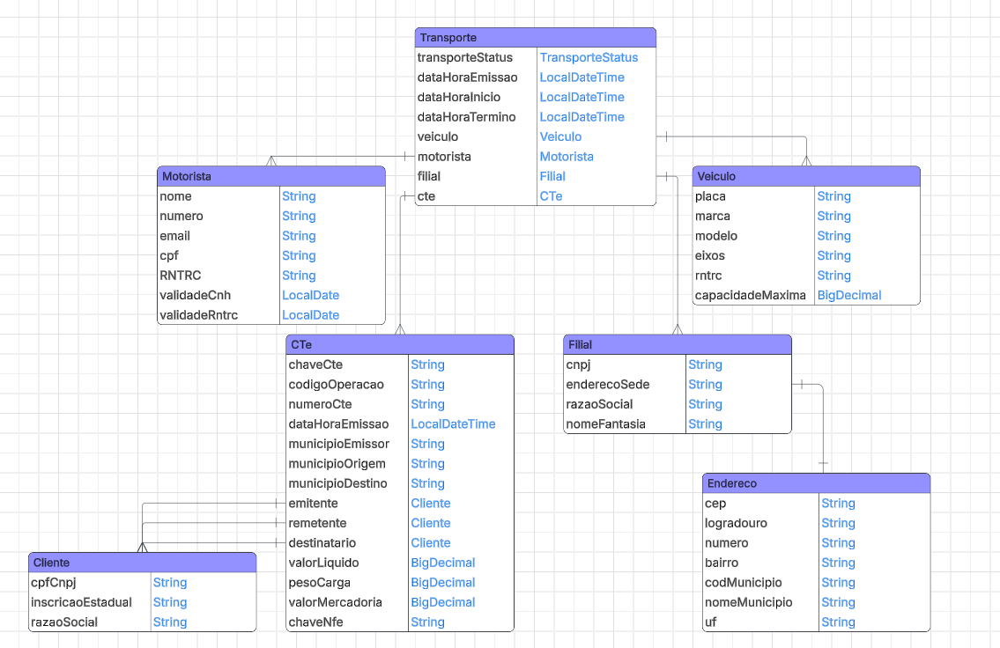

# 🟠 API Splity Transport. Mensageria de documentos eletronicos

API desenvolvida em java com framework springboot, atua na recepção e cadastro de dados necessarios para uma simulação simplificada do processo de emissão de documentos eletronicos

# Padrões de projeto aprendidos:

- States:
utilizado no estado do transporte, sevindo como validação para mudança de estados.

- Factory:
principal uso na criação de respostas padronizadas para a API, não sendo necessario saber todo o processo de criação, somente passar o necessario.

- Chain of Responsability:
utilizado para validar passo a passo se um transporte está apto a ser autorizado.

# Pilares de orientação a objeto:

- Encapsulamento:
Utilizado na maioria das classes, onde seus atributos são privados sendo acessiveis por getters e seters gerados pelo lombok

- Polimorfismo:
Principal uso no XmlJsonBean, classe responsavel pelo processamento dos documentos eletrônicos, bem como ao realizar o parse xml, json, TipoComposto (DTO) e Classe

- Abstração:
Principal aparição nos controllers e services, onde o controller só recebe o dado e chama o serviço especifico, assim toda a lógica de processamento fica escondida dentro de uma única função

- Herança:
Utilizada nas classes de persistencia dos documentos eletrônicos bem como em algumas respostas de api

# Diagrama UML

# Declaração uso de IA:

Declaro que utilizei IA para o auxilo da estruturação geral do projeto, para que o mesmo siga de maneira simplificada porem realista o processo de emissão de documentos eletronicos,
também declaro que a IA foi utilizada no processo de debug, configuração de classes e também na resposta de duvidas sobre o funcionamento de padrões e funcionamento de certas partes da aplicação.
Nenhum código foi totalmente escrito pela IA, sendo eu o responsavel por traduzir a informação dada para o contexto da minha aplicação.
